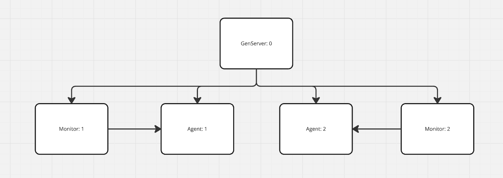

# Quick description

Project for learning purposes to understand how Elixir works.
Topics covered so far:

* Mix overview
* Modules
* Tests
* Agents
* GenServers
  * [GenServers Cheat Sheet](https://elixir-lang.org/downloads/cheatsheets/gen-server.pdf)
  * Client GenServer API | GenServer Callbacks

* `__MODULE__` macro
* Client vs Server (Agent vs GenServer perspectives)
* Monitors vs Links
* Behaviours vs Modules
* Behaviours Callbacks
* @impl true
* Agent init with atoms memory risk (atoms are not garbage collected)

# Overview

